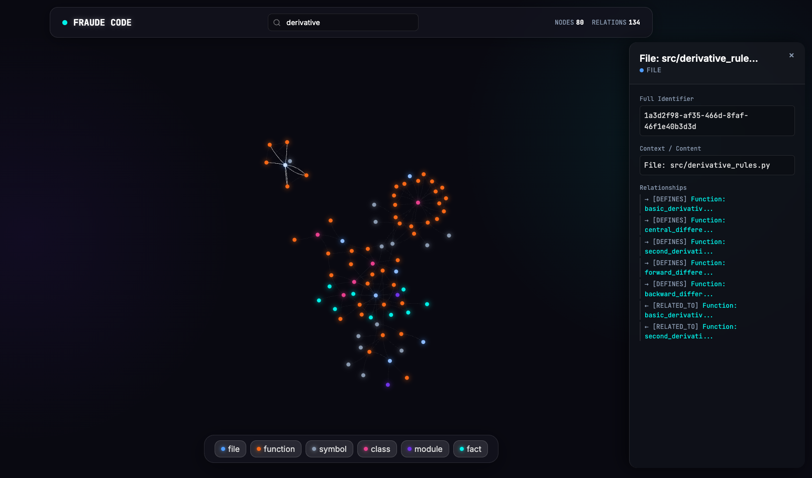

    <picture>
      
    </picture>

Just another AI coding agent.

---

## What is FraudeCode?

FraudeCode is a simple AI coding agent that can help you with your coding tasks. It has 3 different modes:

- Fast Mode: Fast mode is the default mode. It will conduct research, generate code, and then test it itself.
- Planning Mode: Planning mode will create an implementation plan and tasks, using a research subagent to gather context. It will then use a worker subagent to generate code, and a reviewer subagent to review the code. This mode is recommended for larger tasks.
- Ask Mode: Ask mode will use an agent to answer a question about a codebase without altering it.

    <picture>
      
    </picture>

### Graph + Vector Powered Memory

FraudeCode uses a graph + vector powered memory system to dynamically retain knowledge about the codebase and its context across sessions. This feature uses Kuzu as the graph database and LanceDB as the vector database, to store all data locally in the .fraude directory.

    <picture>
      
    </picture>

The first time you start the app, it will automatically index the current directory and store the data in the graph database.
In future runs, it will only index files that have been modified since the last run.

After you make a query and the agent has completed it, a subagent will analyze the conversation and store relevant information in the graph database to remember it for future queries.

You can also manually store data using the `/remember <query>` command. The Knowledge Graph can be wiped completely using the `/forget` command.

If you want to visualize the Knowledge Graph, you can use the `/visualize` command. It will open a new window showing you the graph.

---

## Supported Providers

I went with anyone that had a free tier :|

(This is built on vercel AI SDK so its easy to add more providers)

- Ollama
- Mistral
- Groq
- OpenRouter
- Cerebras
- Google

## Installation

Still in dev so just clone the repo and run `bun run dev`

## Plugins

You can use plugins to extend the functionality of FraudeCode. Check out the [plugins](./plugins) directory for more information.

I'll be building out some plugins with corresponding UIs for some more fun use cases.
